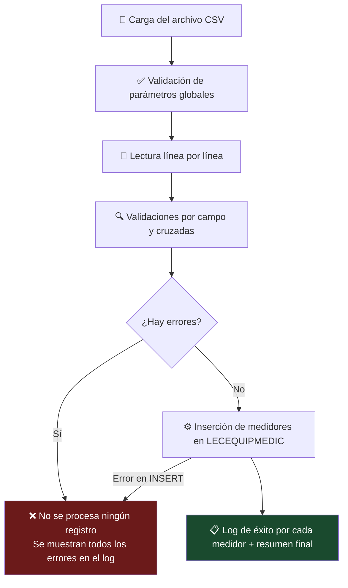

# 📖 Documentación: prc_upfileCreamedidoresMasi

> **Procedimiento UPFILE para la creación masiva de medidores en el sistema.**

---

## 1. Información General

| Campo | Valor |
|-------|-------|
| **Nombre** | `prc_upfileCreamedidoresMasi` |
| **Módulo** | UPFILE (Cargue masivo de archivos) |
| **Tabla destino** | `LECEQUIPMEDIC` |
| **Autor** | Diegoaz |
| **Fecha creación** | 15/05/2026 |
| **Configuración UPFILE** | ID 50 – "CREACIÓN MASIVA MEDIDORES" |
| **Regla en REARCHREGLA** | `BEGIN prc_upfileCreamedidoresMasi(:1,:2,:3); END;` |
| **Tipo de regla** | `AT` (Al procesar el archivo) |

---

## 2. Descripción Funcional

Este procedimiento permite crear medidores de forma masiva a partir de un archivo CSV cargado a través del módulo **Upfile** del sistema. Cada fila del archivo representa un medidor a crear en la tabla `LECEQUIPMEDIC`.

### Flujo del proceso



> **Importante:** Si hay errores de validación en **cualquier línea**, **ningún registro se procesa**. El archivo se rechaza completamente y se muestran todos los errores encontrados.

---

## 3. Estructura del Archivo CSV

- **Separador:** `;` (punto y coma)
- **Primera fila:** Encabezado (se omite en el procesamiento)
- **Codificación:** UTF-8

### Columnas

| # | Campo | Tipo | Obligatorio | Descripción |
|---|-------|------|:-----------:|-------------|
| 1 | **SERIE** | Texto (máx 20 chars) | ✅ Sí | Número de serie / identificador único del medidor |
| 2 | **MARCA** | Número | ✅ Sí | Código de la marca (debe existir en `LECMARCEQUIMEDI`) |
| 3 | **REFERENCIA** | Número | ✅ Sí | Código de referencia (debe existir junto con la marca en `LECREFERMARCA`) |
| 4 | **FECHA_GARANTIA** | Fecha (DD/MM/YYYY) | ❌ No | Fecha de garantía del medidor. Dejar vacío si no aplica |
| 5 | **CANTIDAD_DIGITOS** | Número | ❌ No | Cantidad de dígitos del medidor. Dejar vacío si no aplica |

### Ejemplo de archivo

```csv
SERIE;MARCA;REFERENCIA;FECHA_GARANTIA;CANTIDAD_DIGITOS
SER-00001;1;10;15/05/2026;6
SER-00002;1;10;;4
SER-00003;2;5;01/01/2027;
MED-12345;1;10;30/06/2026;8
```

> **Notas sobre el formato:**
> - Los espacios al inicio y al final de la SERIE se eliminan automáticamente (TRIM)
> - Los campos opcionales pueden dejarse vacíos entre los separadores (ej: `;;`)
> - La fecha debe estar en formato **DD/MM/YYYY** estrictamente

---

## 4. Prerrequisitos y Configuración

### 4.1 Parámetro Global (GEPARAMETRO)

| Parámetro | Descripción | Consulta de verificación |
|-----------|-------------|-------------------------|
| `ESTADO_MEDI_CREADO` | Estado que se asigna al medidor al momento de su creación | `SELECT * FROM geparametro g WHERE g.idparametro = 'ESTADO_MEDI_CREADO'` |

Si este parámetro no existe o su valor numérico es NULL, el proceso se detiene inmediatamente con el mensaje:
> *"No existe configuración para el parámetro: ESTADO_MEDI_CREADO. Por favor contactese con la mesa de servicio."*

### 4.2 Configuración en REARCHREGLA

La regla debe estar registrada así:

```sql
SELECT * FROM rearchregla r WHERE r.idrearchconf = 50;
-- FUNCION: BEGIN prc_upfileCreamedidoresMasi(:1,:2,:3); END;
-- TIPO: AT
```

> ⚠️ **La función DEBE tener el formato `BEGIN ... END;`** con las bind variables `:1, :2, :3`. Sin este formato, `PKG_CARGAARCHIVO.prc_ejecutaregla` lanzará el error `ORA-00900: sentencia SQL no válida`.

### 4.3 Tablas maestras requeridas

| Tabla | Descripción | Qué se valida |
|-------|-------------|---------------|
| `LECMARCEQUIMEDI` | Marcas de equipos de medición | Que la marca exista |
| `LECREFERMARCA` | Referencias por marca | Que la combinación marca + referencia exista |
| `LECEQUIPMEDIC` | Equipos de medición (tabla destino) | Que la serie NO exista previamente |

---

## 5. Validaciones

### 5.1 Validaciones por campo

| Campo | Validación | Mensaje de error |
|-------|-----------|-----------------|
| SERIE | No puede ser NULL | *"La serie del medidor no puede estar vacía."* |
| SERIE | Máximo 20 caracteres | *"La serie del medidor: X excede los 20 caracteres permitidos."* |
| SERIE | No debe existir en `LECEQUIPMEDIC` | *"La serie de medidor X ya existe."* |
| MARCA | No puede ser NULL | *"La marca del medidor no puede estar vacía."* |
| MARCA | Debe existir en `LECMARCEQUIMEDI` | *"La marca digitada X, no existe."* |
| REFERENCIA | No puede ser NULL | *"La referencia del medidor no puede estar vacía."* |
| FECHA_GARANTIA | Formato DD/MM/YYYY (si se proporciona) | Error de parseo capturado automáticamente |
| CANTIDAD_DIGITOS | Mayor a 0 (si se proporciona) | *"La cantidad de dígitos: X no puede ser menor o igual a cero."* |

### 5.2 Validación cruzada

| Validación | Campos | Mensaje de error |
|-----------|--------|-----------------|
| Existencia en `LECREFERMARCA` | MARCA + REFERENCIA | *"La combinación de marca X y referencia Y no existe en la tabla de referencias de marca (LECREFERMARCA)."* |

---

## 6. Lógica de Ejecución (INSERT)

Por cada línea válida del archivo, el procedimiento inserta un registro en `LECEQUIPMEDIC` con los siguientes valores:

| Columna | Origen del valor |
|---------|-----------------|
| `IDEQUIPO` | Campo SERIE del CSV |
| `IDMARCA` | Campo MARCA del CSV |
| `IDREFEMARCA` | Campo REFERENCIA del CSV |
| `FECHACREACION` | `SYSDATE` (fecha actual) |
| `FECHAGARANTIA` | Campo FECHA_GARANTIA del CSV (o NULL) |
| `ESTADO` | `'S'` (fijo) |
| `PROPCLIENTE` | `'S'` (fijo) |
| `PROPEMPRESA` | `'N'` (fijo) |
| `IDTIPOELEMENTO` | Obtenido de `pkg_mdlecrefermarca.fNUGetIDTIPOMEDI(MARCA, REFERENCIA)` |
| `FACTORMULTIP` | `1.0000` (fijo) |
| `NUMDIGITOS` | Campo CANTIDAD_DIGITOS del CSV (o NULL) |
| `IDESTAMEDI` | Valor del parámetro `ESTADO_MEDI_CREADO` |
| `DESCEQUIPO` | Nombre de la marca + Serie (ej: "ELSTER SER-00001") |
| Otros campos | `NULL` |

### Datos derivados automáticamente

- **`IDTIPOELEMENTO`**: Se obtiene de la tabla `LECREFERMARCA` consultando `pkg_mdlecrefermarca.fNUGetIDTIPOMEDI` con la marca y referencia del registro.
- **`DESCEQUIPO`**: Se construye concatenando el nombre de la marca (`pkg_mdlecmarcequimedi.fVAGetNOMBRE`) con la serie del medidor.
- **`IDESTAMEDI`**: Se lee del parámetro global `ESTADO_MEDI_CREADO` en `GEPARAMETRO`.

---

## 7. Paquetes Oracle Utilizados

| Paquete | Función/Procedimiento | Uso |
|---------|----------------------|-----|
| `PKG_MDGEPARAMETRO` | `fboExiste`, `fNUGetPARAVANU` | Validar y obtener el parámetro `ESTADO_MEDI_CREADO` |
| `PKG_MDREARCH` | `fVAGetNOMBRE` | Obtener el nombre del archivo cargado |
| `PKG_CARGAARCHIVO` | `VTYLINE`, `prc_log` | Lectura de líneas del archivo y registro de log |
| `PKG_MDLECEQUIPMEDIC` | `fboExiste`, `InsertaRegistro` | Validar existencia de serie e insertar medidor |
| `PKG_MDLECMARCEQUIMEDI` | `fboExiste`, `fVAGetNOMBRE` | Validar marca y obtener nombre |
| `PKG_MDLECREFERMARCA` | `fboExiste`, `fNUGetIDTIPOMEDI` | Validar marca+referencia y obtener tipo de elemento |
| `PKG_SGERRORLOG` | `Prc_Sgregerror` | Registro de errores en la tabla de errores del sistema |

---

## 8. Log del Proceso

El proceso genera los siguientes mensajes en el módulo de log de archivos cargados:

### En caso de éxito ✅

```
Línea 2: "Se creó la serie de medidor SER-00001 con marca 1 y referencia 10."
Línea 3: "Se creó la serie de medidor SER-00002 con marca 1 y referencia 10."
Línea 0: "Proceso finalizado exitosamente. Se crearon 2 medidores."
```

### En caso de errores de validación ❌

```
Línea 2: "La serie de medidor SER-00001 ya existe."
Línea 2: "La linea 2 no fue procesada. Cantidad de Errores encontrados: 1"
Línea 3: "La marca digitada 999, no existe."
Línea 3: "La linea 3 no fue procesada. Cantidad de Errores encontrados: 1"
Línea 0: "El archivo cargado no fue procesado. Se encontraron 2 líneas con error..."
```

---

## 9. Manejo de Errores

| Tipo | Acción | Registro |
|------|--------|----------|
| **Error controlado** (`expControl`) | `ROLLBACK` completo | `prc_log` + `Prc_Sgregerror` con observación "ERROR CONTROLADO" |
| **Error inesperado** (`WHEN OTHERS`) | `ROLLBACK` completo | `prc_log` + `Prc_Sgregerror` con observación "ERROR INESPERADO" + `SQLERRM` + `BACKTRACE` |

---

## 10. Consideraciones y Solución de Problemas

### Error frecuente: ORA-00900

Si al procesar el archivo aparece `ORA-00900: sentencia SQL no válida`, verificar que la columna `FUNCION` en `REARCHREGLA` tenga el formato correcto:

```sql
-- ❌ Incorrecto
UPDATE rearchregla SET funcion = 'prc_upfileCreamedidoresMasi' WHERE idrearchregla = 46;

-- ✅ Correcto
UPDATE rearchregla SET funcion = 'BEGIN prc_upfileCreamedidoresMasi(:1,:2,:3); END;' WHERE idrearchregla = 46;
```

### Verificaciones rápidas

```sql
-- Verificar que el procedimiento esté compilado y válido
SELECT object_name, status FROM all_objects WHERE object_name = 'PRC_UPFILECREAMEDIDORESMASI';

-- Verificar la regla configurada
SELECT * FROM rearchregla WHERE idrearchconf = 50;

-- Verificar el parámetro global
SELECT * FROM geparametro WHERE idparametro = 'ESTADO_MEDI_CREADO';

-- Consultar marcas disponibles
SELECT le.idmarca, le.nombre FROM lecmarcequimedi le ORDER BY le.idmarca;

-- Consultar referencias por marca
SELECT lec.idmarca, lec.idrefemarca, lec.nombre FROM lecrefermarca lec ORDER BY lec.idmarca, lec.idrefemarca;

-- Verificar si un medidor ya existe
SELECT * FROM lecequipmedic WHERE idequipo = 'SER-00001';
```

---

## 11. Historial de Cambios

| Fecha | Autor | Descripción |
|-------|-------|-------------|
| 15/05/2026 | Diegoaz | Creación inicial del procedimiento |
